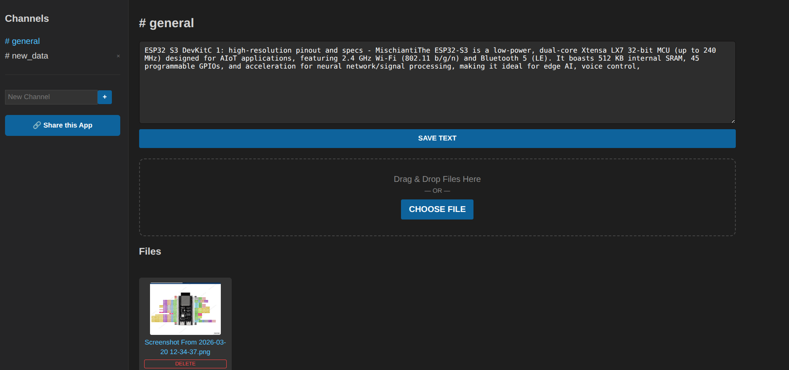
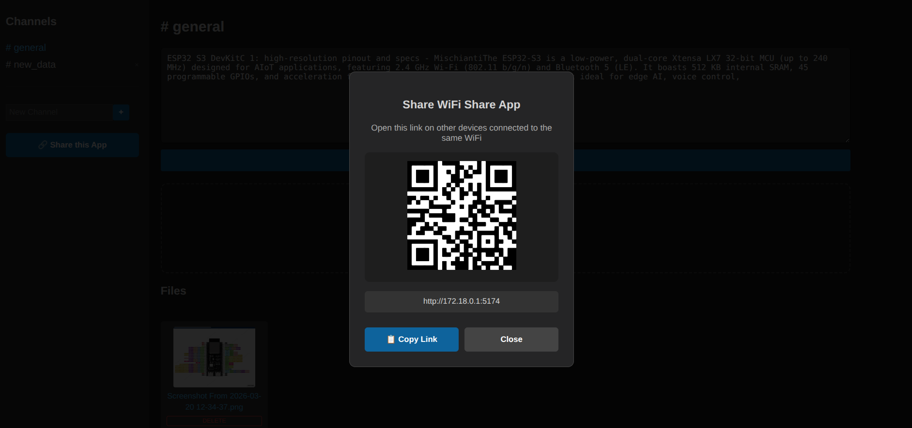

# 📡 WiFi Share

A simple, fast, and beautiful **local WiFi file & text sharing** app built with **React.js + Node.js + Express**.

Share files, images, and notes instantly between devices (phone, laptop, tablet) connected to the **same WiFi** — no internet required.

### Screenshots




## ✨ Features

- ✅ Create multiple **Channels** (like separate rooms)
- ✅ Real-time text notes (auto-save per channel)
- ✅ Drag & Drop file upload + "Choose File" button
- ✅ Image preview support (PNG, JPG, GIF, WebP, etc.)
- ✅ Download files with one click
- ✅ Delete individual files or entire channels
- ✅ Clean dark UI (looks great on desktop & mobile)
- ✅ Works perfectly over local WiFi
- ✅ One-command setup using `npm run dev`

## 🚀 Quick Start

### 1. Clone the repository

```bash
git clone https://github.com/YOUR_USERNAME/wifi-share-react.git
cd wifi-share-react